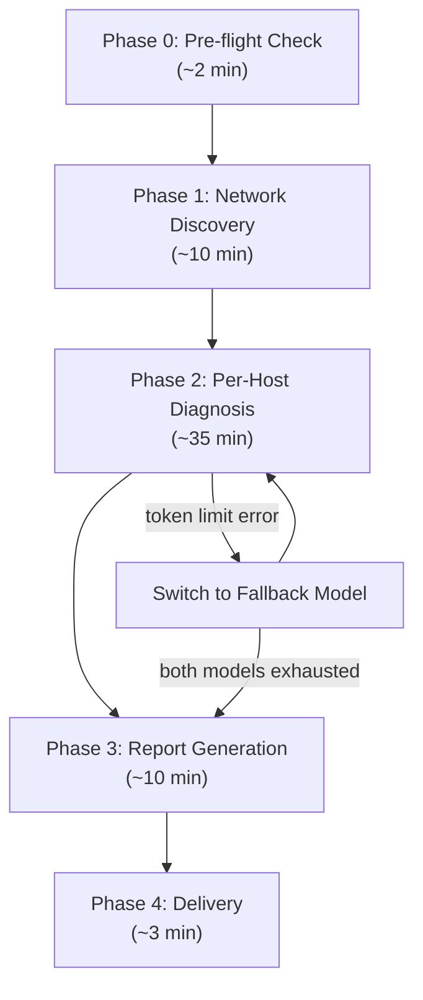

# Private Network Security Scan

一個可由 AI Agent 執行的完整私有網路安全掃描技能。使用 `scan_private_network` 腳本作為核心，在 **60 分鐘內**完成網路發現、逐台主機 11 類風險診斷、以及報告產出。

> [!IMPORTANT]
> 此工作流程會在本機執行 `nmap`（需要 sudo 才能做 OS detection）以及 `traceroute`，會產生實際的網路流量。請確認這在你的網路環境中是被允許的。

> [!WARNING]
> **Token Limit Fallback 策略**：如果主模型觸發 token limit，Agent 會切換至 fallback 模型繼續工作。若兩個模型都耗盡，Agent 會直接依據已收集的資料產出報告，跳過未完成的診斷步驟。

---

## 依賴工具 (Required Tools)

| 工具                   | 路徑                                                      | 用途                       |
| ---------------------- | --------------------------------------------------------- | -------------------------- |
| `nmap` (v7.98)         | `/Users/shuk/.local/homebrew/bin/nmap`                    | 埠掃描、服務偵測、漏洞腳本 |
| `traceroute`           | `/usr/sbin/traceroute`                                    | 網路拓撲追蹤               |
| `dig`                  | `/usr/bin/dig`                                            | DNS zone transfer 測試     |
| `curl`                 | `/usr/bin/curl`                                           | HTTP 安全標頭檢查          |
| `ssh-keyscan`          | `/usr/bin/ssh-keyscan`                                    | SSH 金鑰類型檢查           |
| `scan_private_network` | `/Users/shuk/projects/env_setup/bin/scan_private_network` | 私有網路拓撲掃描腳本       |

---

## 報告輸出結構 (Output Structure)

```text
/Users/shuk/projects/security/scan/<YYYYMMDD>-<scan_type>/
├── report.md      # 主報告（依 resources/report_template.md 產出）
└── network.topo   # 拓撲備份
```

### 命名規則 (Naming Convention)

| 部分        | 格式                         | 範例              |
| ----------- | ---------------------------- | ----------------- |
| `YYYYMMDD`  | 掃描日期                     | `20260216`        |
| `scan_type` | 掃描類型（小寫、連字號分隔） | `private-network` |

**範例**：`scan/20260216-private-network/report.md`

---

## 工作流程 (Workflow)



### 時間預算 (Time Budget)

共 **60 分鐘**

| Phase | 說明                                                          | 時間上限 |
| ----- | ------------------------------------------------------------- | -------- |
| 0     | **Pre-flight Check** — 驗證工具、建立掃描資料夾、複製報告模板 | 2 min    |
| 1     | **Network Discovery** — 執行 `scan_private_network`、解析拓撲 | 10 min   |
| 2     | **Per-Host Diagnosis** — 逐台主機進行 11 類風險診斷           | 35 min   |
| 3     | **Report Generation** — 填入報告模板、產出 `report.md`        | 10 min   |
| 4     | **Delivery** — 備份拓撲、通知用戶、清理暫存                   | 3 min    |

---

### Phase 0: Pre-flight Check (~2 min)

// turbo

1. Check that `nmap` is installed:

```bash
which nmap
```

// turbo 2. Check that `traceroute` is installed:

```bash
which traceroute
```

// turbo 3. Record the scan start time and set variables:

```bash
SCAN_DATE=$(date '+%Y%m%d')
SCAN_START=$(date '+%Y-%m-%d %H:%M:%S')
echo "SCAN_DATE=${SCAN_DATE}" | tee /tmp/scan_meta.env
echo "SCAN_START=${SCAN_START}" >> /tmp/scan_meta.env
```

// turbo 4. Create the scan output directory and copy report template:

```bash
source /tmp/scan_meta.env
SKILL_DIR="$(dirname "$(readlink -f "$0" 2>/dev/null || echo "$HOME/.agent/skill/private-network-scan")")"
SCAN_DIR="/Users/shuk/projects/security/scan/${SCAN_DATE}-private-network"
echo "SCAN_DIR=${SCAN_DIR}" >> /tmp/scan_meta.env
mkdir -p "${SCAN_DIR}"
cp "${SKILL_DIR}/resources/report_template.md" "${SCAN_DIR}/report.md"
```

---

### Phase 1: Network Discovery (~10 min)

5. Run the `scan_private_network` script to build the network topology:

```bash
cd /Users/shuk/projects/env_setup && sudo bin/scan_private_network
```

Wait for completion. The script outputs results to `network.topo` in the current directory.

// turbo 6. Read the generated topology file:

```bash
cat /Users/shuk/projects/env_setup/network.topo
```

7. Parse the topology output and build a **target list** of all discovered hosts:
   - Extract every IP address found in the topology
   - Note which ports/services are already identified
   - Prioritize hosts that have open services (they are more interesting for security analysis)
   - Record the network layers/subnets discovered

---

### Phase 2: Per-Host Security Diagnosis (~35 min)

For **each host** discovered in Phase 1, perform the following checks. Work through hosts in order of priority (hosts with open services first).

**Token Limit Fallback Strategy**:

- If the PRIMARY model hits a token limit error → switch to the FALLBACK model and continue from where you left off
- If the FALLBACK model also hits a token limit → SKIP remaining hosts and jump to Phase 3 immediately
- In the report, mark hosts as "✅ Diagnosed" or "⏭️ Skipped (token limit)" accordingly

#### 2.1 Port Risk Assessment (風險類別 1: 連接埠暴露)

For each host, categorize open ports by risk level per §1 below:

| Risk Level  | Ports                                                    |
| ----------- | -------------------------------------------------------- |
| 🔴 Critical | telnet(23), ftp(21), rsh(514), rlogin(513)               |
| 🟠 High     | rdp(3389), smb(445), vnc(5900), mysql(3306), redis(6379) |
| 🟡 Medium   | http(80), http-alt(8080), dns(53), printer(515,631)      |
| 🟢 Low      | ssh(22), https(443)                                      |

#### 2.2 Service Version Vulnerability Check (風險類別 2: 軟體版本漏洞)

Compare discovered service versions against known vulnerability patterns per §2 below:

- **Boa HTTPd** (any version) — EOL project, multiple CVEs → 🔴
- **OpenSSH < 9.0** — check for known CVEs → 🟠
- **nginx** — check version if available → 🟡
- **CUPS** — check for recent CVEs → 🟡
- Any **EOL software** → 🔴

#### 2.3 HTTP Service Security Headers (風險類別 3: HTTP 安全標頭)

For hosts with HTTP services (port 80, 443, 8080), check security headers:

// turbo

```bash
curl -sI --connect-timeout 5 http://<IP>:<PORT> 2>/dev/null | head -20
```

Check for presence/absence of:

- `X-Frame-Options` → missing = 🟡
- `Content-Security-Policy` → missing = 🟡
- `Strict-Transport-Security` → missing = 🟡
- `X-Content-Type-Options` → missing = 🟡
- `Server` header leaking version → 🟢

#### 2.4 Authentication & Access Control (風險類別 4: 認證與存取控制)

Check for common authentication weaknesses:

- **Default credentials** on routers/IoT/databases → 🔴
- **Anonymous FTP access**: `nmap --script ftp-anon -p 21 <IP>` → 🔴
- **Redis/MongoDB without auth**: `redis-cli -h <IP> ping` → 🔴
- **SMB null session**: `nmap --script smb-enum-shares -p 445 <IP>` → 🟠
- **SNMP default community strings**: `nmap --script snmp-brute -p 161 <IP>` → 🟠

#### 2.5 Encryption & Transport Security (風險類別 5: 加密與傳輸安全)

##### 2.5.1 SSH Configuration Check

For hosts with SSH service (port 22):

// turbo

```bash
ssh-keyscan -T 5 <IP> 2>/dev/null
```

Check:

- Key types offered (RSA, ECDSA, ED25519)
- Whether weak key types are present (DSA, RSA < 2048-bit) → 🟡

##### 2.5.2 TLS/SSL Check

For hosts with HTTPS (port 443):

// turbo

```bash
nmap --script ssl-enum-ciphers -p 443 <IP>
```

Check:

- Weak cipher suites (SSLv3, TLS 1.0/1.1, RC4, DES) → 🟠
- Expired / self-signed certificates → 🟠

#### 2.6 DNS Security Check (風險類別 6: DNS 安全)

For hosts with DNS service (port 53):

// turbo

```bash
dig axfr @<IP> 2>/dev/null | head -50
```

- If zone transfer succeeds → 🔴 Critical
- Check if open resolver: `dig @<IP> example.com` from non-local → 🟠

#### 2.7 Network-Level Attack Surface (風險類別 7: 網路層攻擊面)

Review the network topology for:

- UPnP / SSDP services (port 1900): `nmap --script upnp-info -p 1900 <IP>` → 🟡
- IPv6 enabled but unmonitored → 🟡
- ARP / VLAN / LLMNR observations from topology → 🟠

#### 2.8 Web Application Security (風險類別 8: Web 應用安全)

For hosts with HTTP/HTTPS services:

- Check for exposed admin interfaces (/admin, /login, /management) → 🟠
- Check directory listing: `curl -s http://<IP>/` → 🟡
- Check WebDAV: `nmap --script http-webdav-scan -p 80,443 <IP>` → 🟠

#### 2.9 Data Leakage (風險類別 9: 資料洩漏)

- NFS exports: `showmount -e <IP>` → 🟠 if misconfigured
- SMB shares: `smbclient -L <IP> -N` → 🟠 if anonymous accessible
- mDNS / Bonjour broadcasting → 🟢

#### 2.10 Lateral Movement (風險類別 10: 橫向移動)

Assess from network topology:

- Flat network / no VLAN segmentation → 🟠
- Shared credentials across hosts → 🟠
- SSH key trust / `.rhosts` → 🟡

#### 2.11 IoT & Embedded Devices (風險類別 11: IoT / 嵌入式裝置)

For identified IoT/embedded devices:

- Check firmware version against known updates → 🟠
- Scan for hidden debug ports on non-standard ports → 🔴
- UPnP auto-exposing services → 🟡

#### 2.12 Quick Vulnerability Scan (if time permits)

If more than 15 minutes remain in the time budget, run nmap vuln scripts on high-value targets:

```bash
nmap --script vulners -sV -p <open_ports> <IP> --host-timeout 60s
```

---

### Phase 3: Report Generation (~10 min)

8. Read the report template that was copied in Phase 0:

```bash
source /tmp/scan_meta.env
cat "${SCAN_DIR}/report.md"
```

9. Fill in the report template (`<!-- -->` placeholders) with all findings from Phase 2:
   - **Executive Summary**: host count, service count, risk distribution
   - **Network Topology**: embed `network.topo` content
   - **Findings by severity**: Critical/High → Medium → Low/Info
   - **Per-Host Detail**: each host's full 11-category diagnosis
   - **Scan Limitations**: skipped hosts, timed-out checks
   - **Recommendations**: prioritized remediation steps
   - **Appendices**: raw topology, command log

   Each finding must include:
   - Risk category number (1-11)
   - Severity level (🔴🟠🟡🟢ℹ️)
   - Evidence (raw command output)
   - Remediation steps

10. Write the completed report to `${SCAN_DIR}/report.md`.

---

### Phase 4: Delivery (~3 min)

// turbo 11. Copy the topology file as a dated backup:

```bash
source /tmp/scan_meta.env
cp /Users/shuk/projects/env_setup/network.topo "${SCAN_DIR}/network.topo"
```

12. Record scan end time:

```bash
source /tmp/scan_meta.env
SCAN_END=$(date '+%Y-%m-%d %H:%M:%S')
echo "Scan started: ${SCAN_START}"
echo "Scan ended:   ${SCAN_END}"
```

13. Notify the user that the report is complete, include:
    - Path to the report file (`${SCAN_DIR}/report.md`)
    - Top 3 most critical findings (if any)
    - Number of hosts scanned vs skipped
    - Total scan duration

// turbo 14. Clean up temp files:

```bash
rm -f /tmp/scan_meta.env
```

---

## 風險等級定義 (Risk Severity Levels)

| 等級 | 標籤         | 定義                                     |
| ---- | ------------ | ---------------------------------------- |
| 🔴   | **Critical** | 可直接被利用、無需認證即可存取或控制系統 |
| 🟠   | **High**     | 高度可利用，可能導致資料洩漏或系統入侵   |
| 🟡   | **Medium**   | 存在潛在風險，需搭配其他條件方可利用     |
| 🟢   | **Low**      | 風險有限，屬於最佳實務改善項目           |
| ℹ️   | **Info**     | 僅供參考，無直接安全影響                 |

---

## 風險類別詳細規則 (Risk Category Rules)

### §1 連接埠暴露 (Port Exposure)

依開放埠號的協議特性進行風險分級。

| 等級        | 埠號 / 服務                                              | 風險原因                          |
| ----------- | -------------------------------------------------------- | --------------------------------- |
| 🔴 Critical | Telnet(23), FTP(21), RSH(514), RLogin(513)               | 明文傳輸，無加密認證              |
| 🟠 High     | RDP(3389), SMB(445), VNC(5900), MySQL(3306), Redis(6379) | 遠端存取 / 資料庫暴露，常見攻擊面 |
| 🟡 Medium   | HTTP(80), HTTP-Alt(8080), DNS(53), Printer(515,631)      | 潛在資訊洩漏或未保護的服務        |
| 🟢 Low      | SSH(22), HTTPS(443)                                      | 加密通道，但需驗證配置強度        |

### §2 軟體版本漏洞 (Service Version Vulnerabilities)

比對服務版本與已知 CVE。

| 檢查目標                  | 判定規則                       | 等級 |
| ------------------------- | ------------------------------ | ---- |
| **Boa HTTPd**（任何版本） | 已停止維護 (EOL)，存在多個 CVE | 🔴   |
| **OpenSSH < 9.0**         | 已知 CVE 漏洞                  | 🟠   |
| **nginx**（過時版本）     | 需比對 CVE 資料庫              | 🟡   |
| **CUPS**（列印服務）      | 近期有高風險 CVE               | 🟡   |
| 任何 EOL 軟體             | 無安全更新支援                 | 🔴   |

### §3 HTTP 安全標頭 (HTTP Security Headers)

針對 HTTP 服務（Port 80/443/8080）檢查防護標頭是否存在。

| 標頭                        | 缺少時的風險                      | 等級 |
| --------------------------- | --------------------------------- | ---- |
| `X-Frame-Options`           | 點擊劫持 (Clickjacking)           | 🟡   |
| `Content-Security-Policy`   | XSS 與資源注入                    | 🟡   |
| `Strict-Transport-Security` | 未強制 HTTPS (HSTS)               | 🟡   |
| `X-Content-Type-Options`    | MIME 嗅探攻擊                     | 🟡   |
| `Server` header 洩漏版本    | 資訊洩漏 (Information Disclosure) | 🟢   |

### §4 認證與存取控制 (Authentication & Access Control)

| 風險                              | 判定規則                            | 等級 |
| --------------------------------- | ----------------------------------- | ---- |
| 預設帳密 (Default Credentials)    | 路由器/IoT/資料庫使用出廠密碼       | 🔴   |
| 匿名存取 (Anonymous Access)       | FTP anonymous、Redis/MongoDB 無密碼 | 🔴   |
| SMB 空會話 (Null Session)         | 可列舉使用者與共享資料夾            | 🟠   |
| SNMP 社群字串 (Community Strings) | 使用 `public`/`private` 等預設值    | 🟠   |

### §5 加密與傳輸安全 (Encryption & Transport Security)

| 風險               | 判定規則                     | 等級 |
| ------------------ | ---------------------------- | ---- |
| SSL/TLS 弱加密套件 | SSLv3、TLS 1.0/1.1、RC4、DES | 🟠   |
| 過期 / 自簽憑證    | MITM 風險                    | 🟠   |
| STARTTLS 降級      | SMTP/IMAP 可被剝離加密       | 🟡   |
| SSH 弱金鑰         | DSA 或 RSA < 2048-bit        | 🟡   |

### §6 DNS 安全 (DNS Security)

| 風險                         | 判定規則               | 等級 |
| ---------------------------- | ---------------------- | ---- |
| Zone Transfer 成功 (AXFR)    | 洩漏整個域名記錄       | 🔴   |
| DNS 遞迴開放 (Open Resolver) | 可被用於 DDoS 反射攻擊 | 🟠   |

### §7 網路層攻擊面 (Network-Level Attack Surface)

| 風險                         | 判定規則                  | 等級 |
| ---------------------------- | ------------------------- | ---- |
| ARP 欺騙 (ARP Spoofing)      | 無 Dynamic ARP Inspection | 🟠   |
| VLAN 跳躍 (VLAN Hopping)     | Trunk port 配置不當       | 🟠   |
| LLMNR / NBT-NS 投毒          | Windows 環境憑證竊取      | 🟠   |
| IPv6 未管理                  | 設備啟用 IPv6 但無監控    | 🟡   |
| UPnP / SSDP 開放 (Port 1900) | 內網到外網的自動端口映射  | 🟡   |

### §8 Web 應用安全 (Web Application Security)

| 風險                         | 判定規則                           | 等級 |
| ---------------------------- | ---------------------------------- | ---- |
| 管理介面暴露                 | Router/NAS/Printer admin UI 無防護 | 🟠   |
| WebDAV 開啟                  | 可上傳惡意檔案                     | 🟠   |
| API 端點無認證               | REST API 未設防                    | 🟠   |
| 目錄列表 (Directory Listing) | 洩漏檔案結構                       | 🟡   |

### §9 資料洩漏 (Data Leakage)

| 風險                | 判定規則                      | 等級 |
| ------------------- | ----------------------------- | ---- |
| NFS 共享不當        | `no_root_squash` 或全網段共享 | 🟠   |
| SMB 共享洩漏        | 敏感檔案可匿名存取            | 🟠   |
| DHCP Snooping 缺失  | 偽裝 DHCP 伺服器              | 🟡   |
| mDNS / Bonjour 廣播 | 洩漏服務名稱與版本            | 🟢   |

### §10 橫向移動 (Lateral Movement)

| 風險                        | 判定規則                  | 等級 |
| --------------------------- | ------------------------- | ---- |
| 網段隔離不足 (Flat Network) | 所有設備在同一 VLAN       | 🟠   |
| 共用密碼                    | 多台主機使用相同認證      | 🟠   |
| 跨主機信任關係              | SSH key trust / `.rhosts` | 🟡   |

### §11 IoT / 嵌入式裝置 (IoT & Embedded Devices)

| 風險                         | 判定規則                     | 等級 |
| ---------------------------- | ---------------------------- | ---- |
| 隱藏 Debug 埠                | Telnet/Serial 後門在非標準埠 | 🔴   |
| 韌體過時 (Outdated Firmware) | 路由器/IP Cam/NAS 未更新     | 🟠   |
| UPnP 自動暴露服務            | 繞過防火牆規則               | 🟡   |
